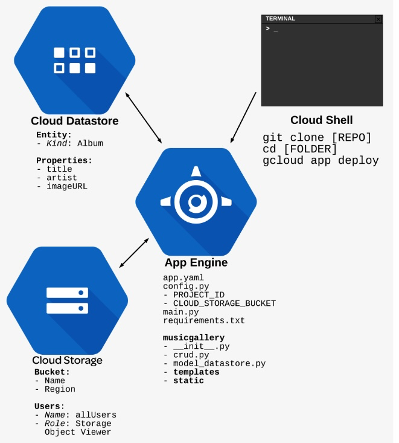
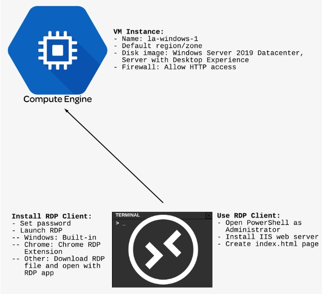
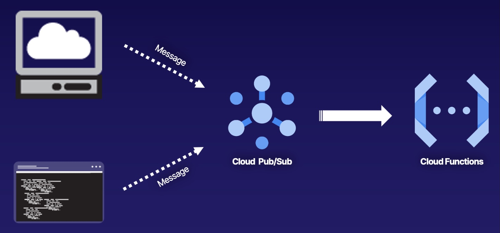

# Deploying an App Engine Application

## Introduction

In this hands-on lab, we’ll deploy an app to App Engine that allows users to enter details into a NoSQL database, Cloud Datastore, and displays the proper HTML template and CSS. The process requires that we customize the `config.py` file before deploying the app.

## Deploying an App Engine Application

Now, on to the lab!

### Enable APIs and clone GitHub repository.

1. Navigate to **APIs & Services** > **Library**, and search for "Datastore".
    
2. Select the **Cloud Datastore API** card.
    
3. Click **Enable**.
    
4. Head back to **APIs & Services** > **Library**.
    
5. Search for "Storage".
    
6. Select the **Cloud Storage** card.
    
7. We should see it's already enabled. (If it isn't, click **Enable**.)
    
8. Repeat the process to enable both the **Cloud Build API** and **Container Registry API**
    
9. Click the icon in the upper right navigation menu to **Activate Cloud Shell**.
    
10. From the Cloud Shell, create the necessary bucket:
    
    `gsutil mb -c regional -l us-east1 gs://<BUCKET NAME>`
    
11. In order to make the objects publicly viewable, we need to add a couple roles:
    
    `gsutil iam ch allUsers:objectViewer gs://<BUCKET NAME>`
    
12. Clone the GitHub repo to bring in all the files we need:
    
    `git clone https://github.com/linuxacademy/content-gc-essentials`
    
13. Change directory to the `content-gc-essentials/app-engine-lab` folder:
    
    `cd content-gc-essentials/app-engine-lab`
    

### Configure `config.py` file.

1. Click the pencil icon to launch the Cloud Shell Editor.
2. From the Cloud Shell Editor, open `config.py` in the `app-engine-lab` folder.
3. Change `PROJECT_ID` to the current project, as shown in the Cloud Shell.
4. Change `CLOUD_STORAGE_BUCKET` to your bucket name.
5. Click **File** > **Save**.

### Deploy the app.

1. In the Cloud Shell, enter the following code:
    
    `gcloud config set app/cloud_build_timeout 6000s gcloud app deploy`
    
2. When prompted, choose the us-east1 region.
    

### Test the app.

1. In the Cloud Shell, enter the following code:
    
    `gcloud app browse`
    
2. If the browser window does not open, click the generated link.

# Working with Compute Engine Windows Instances

In this hands-on lab, we’ll experience the creation of a Windows-based Compute Engine VM instance, set up an IIS server, and push our first web page live to confirm the server’s operation.

## Working with Compute Engine Windows Instances

Now, on to the lab!

### Create a Compute Engine VM instance.

1. From the main navigation, choose **Compute Engine** > **VMs**.
2. Click **Create**.
3. With _New VM instance_ chosen from the options on the left, configure your instance:
    - _Name_: Provide a relevant name using hyphens, like "la-windows-1".
    - _Region_ Leave as-is
    - _Zone_: Leave as-is
    - Series: N1
    - _Machine type_: n1-standard-1
    - _Boot disk_:
        - Click **Change**.
        - Select **Windows Server 2019 Datacenter, Server with Desktop Experience**.
        - Click **Select**.
    - _Identity and API access_: Leave as-is
    - _Firewall_: **Allow HTTP traffic**
4. Click **Create**.

### Set Windows password.

1. Once the instance is created, click the arrow next to **RDP** in the _Connect_ column, and select **Set Windows password** from the dropdown.
2. In the dialog, confirm your username is correct, and click **Set**.
3. Copy the supplied password, and click **Close**.

### Launch RDP window.

1. Launch the RDP window by using one of the following methods:
    - If you're on a Windows system, click **RDP**.
    - If you're on a Mac using Chrome in a standard window, first install the Chrome RDP extension, and then click **RDP**.
    - If you're on a Mac using another browser or incognito window, from the App Store, download and install the latest version of the Microsoft Remote Desktop app. Then, choose **Download the RDP file** from the RDP options and open the file.

### Install IIS.

1. From the Windows Start menu, right-click on Windows Powershell, choose **More** and then **Run as administrator**.
    
2. In the PowerShell window, enter the following commands to set install IIS, starting with:
    
    `import-module servermanager`
    
3. Set up the web server:
    
    `add-windowsfeature web-server -includeallsubfeature`
    
4. Create the `index.html` page:
    
    `echo '<!doctype html><html><body><h1>Greetings from Linux Academy!</h1></body></html>' > C:\inetpub\wwwroot\index.html`
    

### Test your page.

1. From the Compute Engine _VM instances_ page, click the external IP link for the Windows VM instance.
2. Review the page in the browser.

# Triggering a Cloud Function with Cloud Pub/Sub

Cloud Functions can be triggered in 2 ways: through a direct HTTP request or through a background event. One of the most frequently used services for background events is Cloud Pub/Sub, Google Cloud’s platform-wide messaging service.

In this pairing, Cloud Functions becomes a direct subscriber to a specific Cloud Pub/Sub topic, which allows code to be run whenever a message is received on a specific topic. In this hands-on lab, we’ll walk through the entire experience, from setup to confirmation.

## Solution

On the lab page, right-click **Open GCP Console** and select the option to open it in a new private browser window (this option will read differently depending on your browser — e.g., in Chrome, it says "Open Link in Incognito Window"). Then, sign in to Google Cloud Platform using the credentials provided on the lab page.

On the _Welcome to your new account_ screen, review the text, and click **Accept**. In the "Welcome L.A.!" pop-up once you're signed in, check to agree to the terms of service, choose your country of residence, and click **Agree and Continue**.

### Enable Required APIs

1. From the main console navigation, go to **APIs & Services** > **Library**.
2. Search for **Pub/Sub**.
3. Select the **Cloud Pub/Sub API** card.
4. Click **ENABLE**, if displayed.
5. Return to the API Library and search for **functions**.
6. Select the **Cloud Functions API** and click **ENABLE**.
7. Return to the API Library and search for **build**.
8. Select the **Cloud Build API** and click **ENABLE**.

### Create Pub/Sub Topic

1. Using the main navigation menu, under _Analytics_ go to **Pub/Sub** > **Topics**.
2. Click **CREATE TOPIC**.
3. For the _Topic ID_, enter a name for the topic (e.g., "greetings").
4. Click **CREATE TOPIC**.

### Create a Cloud Function

1. Using the main navigation, under _SERVERLESS_, go to **Cloud Functions**.
2. Click **CREATE FUNCTION**.
3. Configure the function with the following values:
    - _Name:_ **acg-pubsub-function**
    - _Region:_ **us-central1**
    - _Trigger:_ **Cloud Pub/Sub**
    - _Topic:_ The topic you just created
4. Click **SAVE**.
5. Click **NEXT**.
6. For the _Runtime_, select **Python 3.9**.
7. Using the _Inline Editor_, select the `main.py` file.
8. Delete the existing code, and paste in the following:

`import base64 def greetings_pubsub(data, context): if 'data' in data: name = base64.b64decode(data['data']).decode('utf-8') else: name = 'folks' print('Greetings {} from Linux Academy!'.format(name))`

1. Set _Entry point_ to **greetings\_pubsub**.
2. Click **DEPLOY**.
    
    > _Note:_ This process can take up to two minutes to complete.
    

### Publish Message to Topic From Console

1. Click the newly created Cloud Function.
2. Switch to the **Trigger** tab.
3. Click the topic link to go to the Cloud Pub/Sub topic.
4. Scroll down to the bottom of the page and switch to the **MESSAGES** tab.
5. Click **PUBLISH MESSAGE**.
6. Under _Message body_, enter the following "everyone around the world".
7. Click **PUBLISH**.

### Confirm Cloud Function Execution

1. Return to the Cloud Functions dashboard and click the **LOGS** tab.
2. Review the logs and confirm the function was executed successfully.

### Trigger Cloud Function Directly From Command Line

1. At the top of the page, click the _Project_ field, and copy the project `ID`.
    
2. Click the icon in the top right corner of the console to activate Cloud Shell.
    
3. When prompted, click **Continue**.
    
4. Enter the following to set the project ID:
    
    `gcloud config set project <PROJECT_ID>`
    
5. When prompted, click **Authorize**.
    
6. Using the following, set a variable called `DATA`:
    
    `DATA=$(printf 'my friends' | base64)`
    
7. Using the `DATA` variable, trigger the function:
    
    `gcloud functions call acg-pubsub-function --data '{"data":"'$DATA'"}'`
    
8. Review the logs and confirm the function was executed successfully.
    

### Publish Message to Topic From Command Line

1. In the Cloud Shell, enter the following command:
    
    `gcloud pubsub topics publish greetings --message "y'all"`
    
2. Review the logs and confirm the function was executed successfully.

